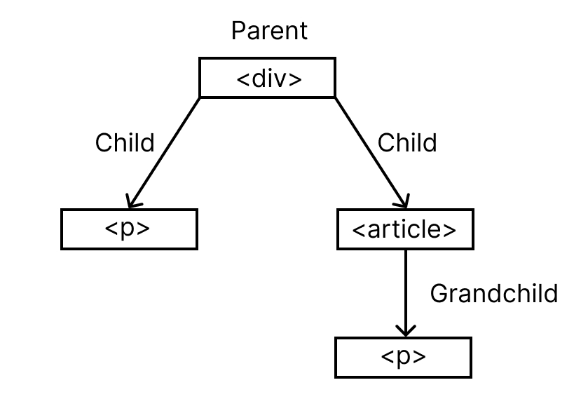

# Child Selector

> Saat melihat file style css akan terlihat bahwa semua code css sudah di comment semua dan ketika dijalankan tidak akan tampil style-nya. Ini digunakan agar tidak terjadi timpa menimpa <s>text</s> style, karena css ada penjelasan mengenai cascade dan inheritance.

> Untuk memastikan semua style tampil, setiap selesai menggunakan dan memahami code css maka yang perlu dilakukan adalah memberikan comment lagi pada code tersebut. Untuk memberi atau menghilangkan comment bisa block code tersebut dan gunakan shortcut keyboard dengan cara pencet `ctrl` + `/`.

Child selector digunakan untuk mencari first child atau anak pertama dari struktur DOM HTML. Mirip seperti Descendant Selector yang dimana menggunakan strukur DOM parent-child element.

Sebelum masuk ke contoh child selector, saya akan coba terlebih dahulu dengan descendant selector agar lebih paham perbedaan antara kedua selector ini.

berikut contoh penerapan-nya

```html
<h1>Belajar CSS</h1>
<p>Paragraf Pertama diluar</p>
    <div>
        <p>Paragraf pertama dalam tag div</p>
        <p>Paragraf kedua dalam tag div</p>
        <article>
            <p>Paragraf yang berada di dalam tag div dan article</p>
            <p>Paragraf yang berada di dalam tag div dan article</p>
        </article>
        <p>Paragraf ketiga dalam tag div</p>
    </div>
```

```css
div p {
    color: blue;
}
```

Jika dijalankan, maka seluruh tag `<p>` yang berada di dalam tag `<div>` akan berubah warna-nya, bahkan tag `<p>` yang berada didalam tag `<article>` pun tetap berubah warna-nya. Karena tag `<article>` tetap berada di dalam tag `<div`.

<hr>

Perbedaan dari Child Selector adalah dia hanya mencari first child (anak pertama) dari tag parent (induk). Untuk menggunakan child selector maka dipisahkan dengan tanda lebih besar `>`.

Saya akan melakukan 2 percobaan mengenai child selector ini agar lebih paham cara pengunaan-nya.

> Perhatikan penjelasan berikut mengenai struktur DOM HTML diatas, ini perlu dipahami karena cukup membingungkan.

1. Tag `<div>` memiliki 2 anak yaitu tag `<p>` dan tag `<article>`.
2. Meskipun tag `<p>` ditulis 3x, namun tetap dianggap sebagai anak pertama karena penulisan tag berulang dianggap sama, untuk membedakan hal ini ada selector tersendiri.
3. Tag `<p>` anak pertama dari induk `<div>`
3. Tag `<article>` anak kedua dari induk `<div>`

Berikut contoh diagram strukur DOM jika dibuat dengan struktur data pohon.



## 1. Percobaan Pertama

Berikut contoh penerapan-nya.

```html
<div>
    <p>Paragraf pertama dalam tag div</p>
    <p>Paragraf kedua dalam tag div</p>
    <article>
        <p>Paragraf yang berada di dalam tag div dan article</p>
        <p>Paragraf yang berada di dalam tag div dan article</p>
    </article>
    <p>Paragraf ketiga dalam tag div</p>
</div>
```

```css
div > p {
    color: blue;
}
```

Jika dijalankan, terlihat bahwa semua tag `<p>` yang berada di dalam tag `<div>` akan memiliki style warna yang sama. Namun, tag `<p>` yang berada didalam tag `<article>` tidak memiliki style.

Mengapa demikian? Karena tag `<p>` yang berada di dalam tag `<article>` bukanlah anak pertama dari tag `<div>` meskipun tag tersebut berada di dalam tag `<div>`.

Tag `<div>` menganggap tag `<p>` yang berada di dalam tag `<article>` adalah grandchild atau cucu. Karena child selector bekerja untuk anak pertama, maka cucu tidak akan dianggap sebagai anak.

## 2. Percobaan Kedua

Sekarang, saya akan mencoba child selector untuk diterapkan dalam list bersarang (nested list). List bersarang itu seperti list didalam list.

berikut contoh penerapan-nya

```html
<ol>
    <li>List 1</li>
    <li>List 2</li>
        <ul>
            <li>Sub List 1</li>
            <li>Sub List 2</li>
            <li>Sub List 3</li>
        </ul>
    <li>List 3</li>
    <li>List 4</li>
</ol>
```

```css
ul > li {
    color: blue;
}
```

Jika dijalankan, terlihat bahwa tag `<li>` yang ada didalam tag `<ul>` lah yang berubah warna-nya, selain itu tidak berubah meskipun ada tag `<li>` lagi diluar-nya.
