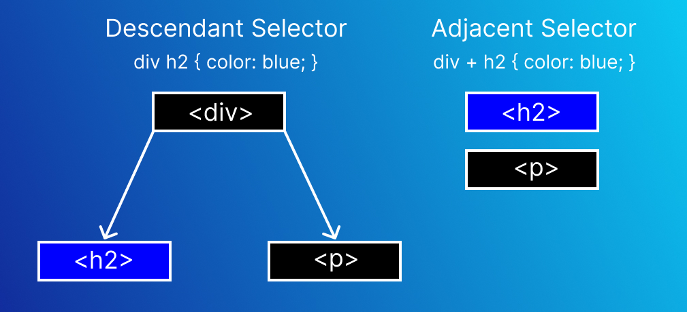

# Adjacent Selector

> Saat melihat file style css akan terlihat bahwa semua code css sudah di comment semua dan ketika dijalankan tidak akan tampil style-nya. Ini digunakan agar tidak terjadi timpa menimpa <s>text</s> style, karena css ada penjelasan mengenai cascade dan inheritance.

> Untuk memastikan semua style tampil, setiap selesai menggunakan dan memahami code css maka yang perlu dilakukan adalah memberikan comment lagi pada code tersebut. Untuk memberi atau menghilangkan comment bisa block code tersebut dan gunakan shortcut keyboard dengan cara pencet `ctrl` + `/`.

Adjacent selector digunakan untuk mencari hubungan saudara (sibling relationship) dari struktur DOM. Berbeda dengan hubungan parent child element. Hubungan saudara ini cukup membingungkan, karena tag yang di style hanyalah hubungan terdekat.

berikut contoh penerapan-nya

```html
<h1>Belajar CSS</h1>
<p>Paragraf Pertama yang ada didalam tag body</p>

    <div>
        <h2>Header 2 dalam tag div</h2>
        <p>Paragraf pertama dalam tag div</p>
        <p>Paragraf kedua dalam tag div</p>
    </div>

    <div>
        <h2>Header 2 dalam tag div</h2>
        <p>Paragraf pertama dalam tag div</p>
        <p>Paragraf kedua dalam tag div</p>
    </div>

<h2>Header h2 di luar tag div</h2>
<p>Paragraf yang berada di luar tag div</p>
```

```css
h2 + p {
    color: red;
}
```

Jika dijalankan, maka seluruh tag `<p>` setelah tag `<h2>` (hubungan saudara yang berdekatan) akan di style. Lihat juga bahwa tag `<p>` yang kedua tidak di style, karena tidak berdekatan dengan tag `<h2>`.

## Adjacent vs Descendant

Adjacent Selector dan Descendant Selector terkadang membuat bingung saya karena perilaku mereka hampir mirip. Berikut ini penjelasan singkat mengenai perbedaan dua selector itu.

1. `Adjacent Selector` = Cari tag 1 dan style tag 2.
2. `Descendant Selector` = Cari tag 1 dan style semua tag yang berkaitan dengan tag 1.

berikut contoh penerapan-nya

```html
<div>
    <h2>Header 2 dalam tag div</h2>
    <p>Paragraf pertama dalam tag div</p>
    <p>Paragraf kedua dalam tag div</p>
</div>
<div>
    <h2>Header 2 dalam tag div</h2>
    <p>Paragraf pertama dalam tag div</p>
    <p>Paragraf kedua dalam tag div</p>
</div>

<h2>Header h2 di luar tag div</h2>
<p>Paragraf yang berada di luar tag div</p>
```

```css
/* Descendant Selector */
div h2 {
    color: red;
}

/* Adjacent Selector */
div + h2 {
    color: blue;
}
```

Jika dijalankan, terlihat bahwa descendant selector akan membuat semua tag `<h2>` yang berada didalam tag `<div>` akan berubah warna style-nya. Sedangkan untuk adjacent selector dia akan mencari tag `<div>` dan **dibawah** tag `<div>` ada tag `<h2>` atau tidak. Jika ada maka style tag teresebut dan jika tidak ada maka biarkan saja.

Berikut gambaran struktur DOM-nya

