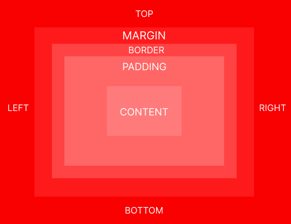

# CSS Box Model

CSS Box Model adalah sebuah konsep dimana setiap element yang terdapat pada halaman web diproses sebagai kotak (box). Mulai dari paragraf, header, form, gambar, logo hingga video sebenarnya di tampilkan oleh web browser sebagai 'box'.

1. `content` adalah element terdalam pada Box Model. Saya bisa mengatur konten dengan menambah lebar (width) dan tinggi (height) element.

2. `padding` merupakan jarak antara `content` dan garis tepi `border`. Ketika saya mengisi konten tersebut dengan `border` lalu ingin memberikan jarak antara `content` dan `border`, maka gunakan `padding`.

3. `border` merupakan garis tepi pada `content`.

4. `margin` merupakan element terluar dari Box Model. Berfungsi sebagai mengatur jarak pembatas antar element.

## Link Tree

1. [01-width_height](https://github.com/naidra68/belajar-css/tree/main/02-css/04-box_model/01-width_height)
2. [02-overflow](https://github.com/naidra68/belajar-css/tree/main/02-css/04-box_model/02-overflow)
3. [03-padding](https://github.com/naidra68/belajar-css/tree/main/02-css/04-box_model/03-padding)
4. [04-border](https://github.com/naidra68/belajar-css/tree/main/02-css/04-box_model/04-border)
5. [05-margin](https://github.com/naidra68/belajar-css/tree/main/02-css/04-box_model/05-margin)
6. [06-reset](https://github.com/naidra68/belajar-css/tree/main/02-css/04-box_model/06-reset)
7. [07-box_sizing](https://github.com/naidra68/belajar-css/tree/main/02-css/04-box_model/07-box_sizing)
8. [08-outline](https://github.com/naidra68/belajar-css/tree/main/02-css/04-box_model/08-outline)
9. [09-vw_vh](https://github.com/naidra68/belajar-css/tree/main/02-css/04-box_model/09-vw_vh)