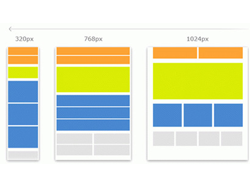

# Jenis-Jenis Layout

Ketika berbicara mengenai jenis layout, dahulu sebelum era **Responsive Web Design**. Layout website biasanya hanya terdiri dari 2 jenis layout yaitu **fixed layout** dan **fluid layout**.

## 1. Fixed Layout

Fixed layout adalah sebutan tampilan web yang selalu tetap. Fixed layout relatif mudah dirancang karena developers memiliki kontrol untuk mengatur pixel demi pixel setiap tampilan web-nya.

Fixed layout umumnya dibuat untuk monitor dekstop yang cukup lebar dengan resolusi 1024 pixel ke atas. Namun jika diakses dari perangkat dengan layar berukuran kecil seperti smartphone, maka developers terpaksa menggunakan fitur zoom dengan menggeser-geser scrollbar.

*sumber : [Smashingmagazine](https://www.smashingmagazine.com/2009/06/fixed-vs-fluid-vs-elastic-layout-whats-the-right-one-for-you/)*

## 2. Fluid Layout

Fluid layout adalah sebuatan untuk tampilan website yang dibuat dengan satuan relatif seperti percent (`%`). Dengan hal ini, lebar dari website akan berubah-ubah tergantung ukuran layar.

Bagi developer, membuat website dengan fluid layout ini cukup susah karena developer tidak memiliki kontrol penuh terhadap penempatan layout element-nya. Seperti contoh komponen sidebar jika diperkecil secara terus menerus maka dia akan tetap tidak mengecil dan kurang pas karena terlalu sempit.

*sumber : [Smashingmagazine](https://www.smashingmagazine.com/2009/06/fixed-vs-fluid-vs-elastic-layout-whats-the-right-one-for-you/)*

## 3. Responsive Layout

Responsive layout adalah gabungan dari 2 jenis layout sebelumnya. Selain memakai ukuran relatif (sama seperti fluid layout), developer bisa menentukan bagaimana tampilan web untuk setiap ukuran layar (seperti fixed layout). Pada responsive layout, sidebar di kiri atau kanan bisa ditampilkan, diperkecil, atau disembunyikan jika dibutuhkan.

Kelamahan dari responsive layout adalah lebih susah untuk dirancang karena harus buat perancangan yang matang untuk menentukan element mana yang tampil dan bagaimana urutan-nya.

Meskipun untuk merancang responsive layout dijaman sekarang terbilang sangat mudah karena bantuan tools seperti css framework ataupun menggunakan AI, namun saya sebagai developer harus paham fundamental mengenai perancangan layout ini tanpa bantuan tools terlebih dahulu, agar terlatih logic dan seni perancangan.

*sumber : [Kentico](https://devnet.kentico.com/articles/how-to-create-a-responsive-website-at-speed-in-mvc)*