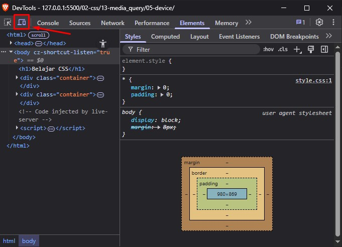
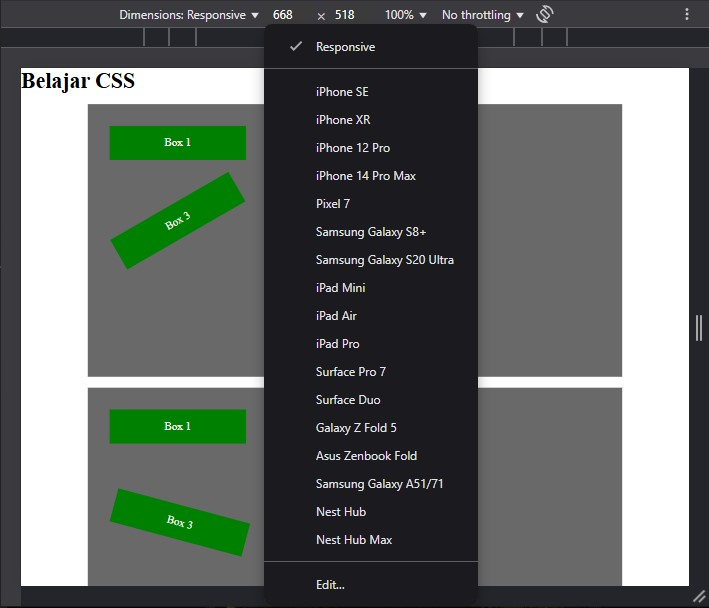

# Device

Ketika membahas mengenai media query width dan height, maka yang menjadi patokan untuk breakpoint adalah lebar atau tinggi dari jendela web browser (viewport).

Untuk media query device with dan device height, yang menjadi ukuran adalah lebar atau tinggi sebenarnya dari layar. Misalnya, untuk perangkat dengan resolusi asli 1080 x 1920 pixel, developer bisa buat breakpoint sebagai berikut:

```css
div {
background-image: url('logo.jpg');
}
@media (min-device-width: 1080px) {
div {
background-image: url('logo_HD.jpg');
}
}
```

Penggunaan media query seperti ini relatif jarang karena terdapat faktor device pixel ratio yang bisa berbeda-beda pada tiap perangkat. Gambar logo_HD.jpg mungkin saja akan terlalu besar pada perangkat tertentu.

Perbedaan antara viewport web browser dengan resolusi perangkat ini bisa menimbulkan masalah tersendiri. Sebagai contoh, untuk mendesain tampilan pada Samsung Galaxy S21,
berapakah ukuran resolusi yang digunakan?

Selain itu, walaupun developer telah memakai media query sesuai dengan standarnya, kadang website tetap tampil berbeda. Ini terjadi karena terdapat fitur zoom di web browser
smartphone yang seolah-oleh membuat web tampil responsive.

Untuk mengatasi hal ini, perlu perintah khusus untuk web browser smartphone agar masuk ke "mobile mode". Caranya dengan menambah sebuah meta tag viewport di bagian `<head>`, sebagai berikut:

```html
<meta name="viewport" content="width=device-width, initial-scale=1">
```

Untuk pengguna VS Code, ketika membuat halaman html awal pasti tidak asing dengan tag meta tersebut, karena sudah menjadi standar snippet VS Code untuk html.

Meta tag ini berfungsi agar ukuran viewport web browser diatur secara otomatis mengikuti ukuran ideal dari perangkat tersebut (device-width).

Waktu awal sebelum pembahasan mengenai media query, saya menyinggung extension `Responsive Viewer` yang harus di install agar lebih mudah untuk mengecil dan membesarkan jendela web browser.

Selain menggunakan extension tersebut. Ternyata web browser memiliki fitur uji coba responsive tanpa harus menginstall apapun. Untuk membuka-nya bisa melihat pada developer tools web browser atau menekan kombinasi tombol `ctrl` + `shift` +  `i`.

Jika sudah terbuka, silhkan klik Toogle Device Toolbar atau bisa menekan tombol kombinasi `ctrl` + `shift` +  `m`.





Gambar diatas akan memperlihatkan, jika uji coba responsive bisa langsung dipakai dengan menggunakan developer tools dari web browser.