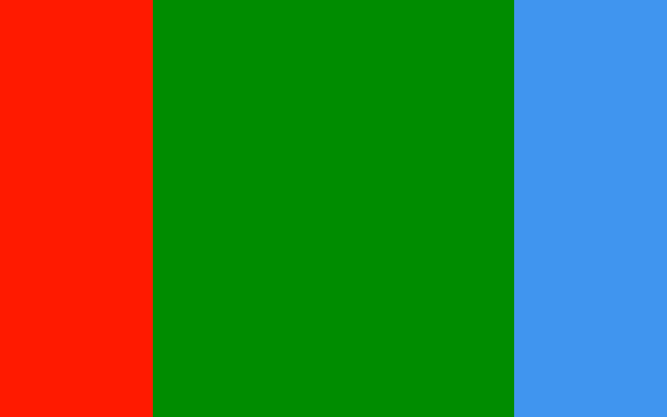
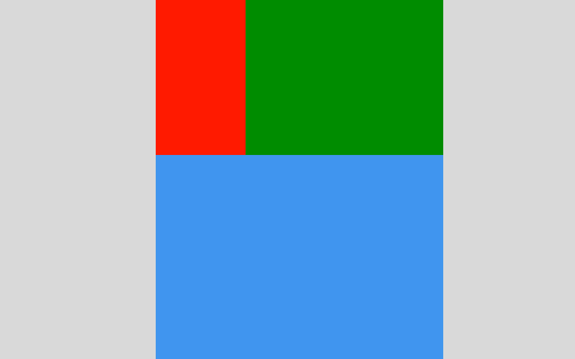
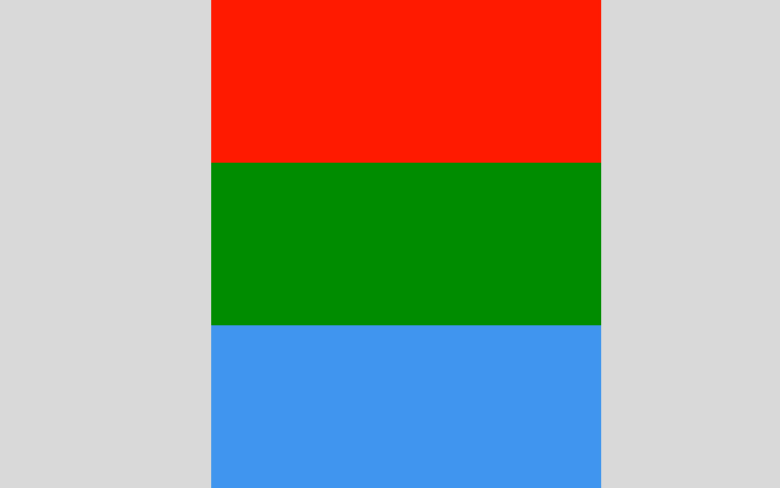
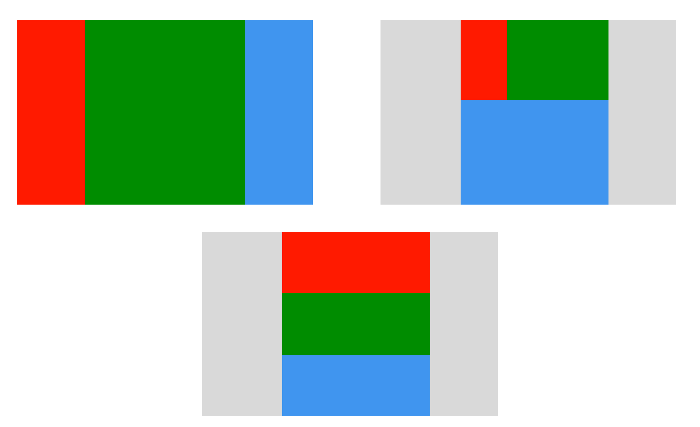

# Responsive Layout

Setelah mempelajari mengenai media query untuk membuat website tampil responsive. Sekarang saya akan mencoba membuat sebuah halaman website sederhana dengan tampilan responsive.

Sebagai contoh, saya akan menggunakan sebuah box yang terdiri dari warna merah, hijau, dan biru. Saya ingin 3 box tersebut akan tampil responsive sesuai lebar layar web browser.

## 1. Desktop dan Laptop Mode

Ketika dalam mode dekstop dan laptop, maka tampilan-nya sebagai berikut.



berikut contoh penerapan-nya

```html
<div class="container">
    <div class="satu"></div>
    <div class="dua"></div>
    <div class="tiga"></div>
</div>
```

```css
/* Desktop and Laptop Mode */

.container {
    width: 960px;
    margin: 0 auto;
    background-color: gray;
}

.satu {
    width: 20%;
    height: 300px;
    background-color: #FF1A00;
    float: left;
}
.dua {
    width: 60%;
    height: 300px;
    background-color: #008C00;
    float: left;
}
.tiga {
    width: 20%;
    height: 300px;
    background-color: #4096EE;
    float: left;
}
```

## 2. Tablet Mode

Ketika dalam mode tablet, maka tampilan-nya sebagai berikut.



berikut contoh penerapan-nya

```html
<div class="container">
    <div class="satu"></div>
    <div class="dua"></div>
    <div class="tiga"></div>
</div>
```

```css
/* Tablet Mode */

@media screen and (min-width: 501px) and (max-width: 900px) {
    .container {
        width: 500px;
    }
    .satu {
        width: 30%;
        float: left;
    }
    .dua {
        width: 70%;
        float: left;
    }
    .tiga {
        width: 100%;
        float: none;
        clear: both;
    }
}
```

## 3. Smartphone Mode

Ketika dalam smartphone, maka tampilan-nya sebagai berikut.



berikut contoh penerapan-nya

```html
<div class="container">
    <div class="satu"></div>
    <div class="dua"></div>
    <div class="tiga"></div>
</div>
```

```css
/* Smartphone Mode */

@media screen and (max-width: 500px) {
    .container {
        width: 300px;
    }
    .satu {
        width: 100%;
        float: none;   
    }
    .dua {
        width: 100%;
        float: none;   
    }
    .tiga {
        width: 100%;
        float: none;   
    }
}
```

<hr>

Cukup banyak yah jika dipecah satu-persatu. Sekarang, saya akan gabungkan semua style css nya menjadi satu biar tampilannya bisa menjadi satu kesatuan yang utuh.

## 4. All Device



berikut contoh penerapan-nya

```html
<div class="container">
    <div class="satu"></div>
    <div class="dua"></div>
    <div class="tiga"></div>
</div>
```

```css
/* Desktop and Laptop Mode */

.container {
    width: 960px;
    margin: 0 auto;
    background-color: gray;
}

.satu {
    width: 20%;
    height: 300px;
    background-color: #FF1A00;
    float: left;
}
.dua {
    width: 60%;
    height: 300px;
    background-color: #008C00;
    float: left;
}
.tiga {
    width: 20%;
    height: 300px;
    background-color: #4096EE;
    float: left;
}

/* Tablet Mode */

@media screen and (min-width: 501px) and (max-width: 900px) {
    .container {
        width: 500px;
    }
    .satu {
        width: 30%;
        float: left;
    }
    .dua {
        width: 70%;
        float: left;
    }
    .tiga {
        width: 100%;
        float: none;
        clear: both;
    }
}

/* Smartphone Mode */

@media screen and (max-width: 500px) {
    .container {
        width: 300px;
    }
    .satu {
        width: 100%;
        float: none;   
    }
    .dua {
        width: 100%;
        float: none;   
    }
    .tiga {
        width: 100%;
        float: none;   
    }
}
```