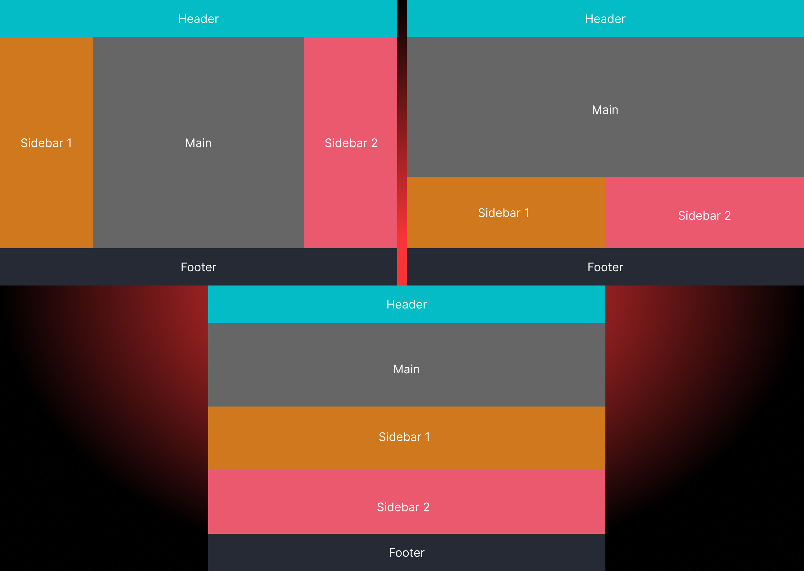

# Membuat Layout Sederhana dengan Flexbox

Dengan pemahaman mengenai flexbox untuk desain layout website, saatnya menguji kemampuan saya untuk membuat layout sederhana menggunakan flexbox ini.

Berikut contoh desain yang akan saya buat dimulai dari tampilan desktop dan laptop,tablet, dan smartphone.



berikut contoh penerapan-nya

```html
<header class="header">Header</header>
<main class="main">Lorem, ipsum dolor sit amet consectetur adipisicing elit. Ullam ducimus iure ipsa debitis quod voluptas nam accusantium nostrum soluta. Vel dolorem possimus, aliquid suscipit amet optio minus corporis quasi illo!</main>
<aside class="sidebar1">Sidebar 1</aside>
<aside class="sidebar2">Sidebar 2</aside>
<footer class="footer">Footer</footer>
```

```css
* {
    padding: 0;
    margin: 0;
}
body {
    display: flex;
    flex-flow: row wrap;
    color: white;
    text-align: center;
    width: 100vw;
    height: 100vh;
    font-size: 2rem;
}
body > * {
    padding: 10px;
    flex-basis: 100%;
}
main,header,footer,aside {
    display: flex;
    justify-content: center;
    align-items: center;
}
.header {background-color: #04bcc5;}
.main {background-color: #666666;}
.sidebar1 {background-color: #cf781e;}
.sidebar2 {background-color: #eb596e;}
.footer {background-color: #252a34;}

@media (min-width: 600px) {
    .sidebar1 {flex-basis: auto; flex-grow: 1;}
    .sidebar2 {flex-basis: auto; flex-grow: 1;}
}
@media (min-width: 900px) {
    .header {order: 1;}
    .sidebar1 {order: 2;}
    .main {order: 3; flex-basis: 50%; flex-grow: 1;}
    .sidebar2 {order: 4;}
    .footer {order: 5;}
}
```