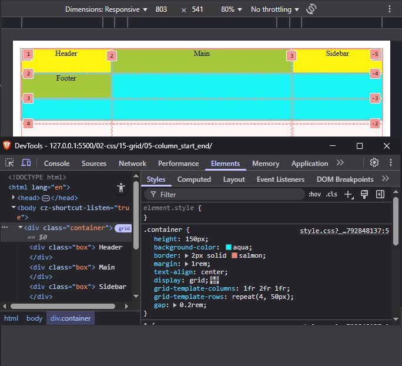

# Grid Column Start and End

Property ini digunakan untuk menggabungkan kolom grid. Terdapat 2 cara yang dapat dipakai yaitu :

- penggabungan dengan menghitung urutan kolom
- menggunakan grid-area

Sebenarnya menggunakan grid-area akan lebih mudah. Namun sebelum masuk ke grid-area, saya akan mencoba penggabungan dengan menghitung urutan kolom secara manual.

Agar perhitungan bisa dilakukan, saya memerlukan developer tool untuk melihat nomer urut awal dan akhir dari garis grid, karena 2 property tersebut memerlukan nilai.

Ketika menggunakan developer tool untuk melihat nilai awal dan akhir grid, maka akan terlihat setiap baris dan kolom terdapat nilai positif dan negatif. Saya fokuskan ke nilai positif kolom grid.



> **CSS Wajib**

```css
.container {
    height: 150px;
    background-color: aqua;
    border: 2px solid salmon;
    margin: 1rem;
    text-align: center;
    display: grid;
    grid-template-columns: 1fr 2fr 1fr;
    grid-template-rows: repeat(4, 50px);
    gap: 0.2rem;
}
.box {
    background-color: yellow;
}
.box:nth-child(even) {
    background-color: yellowgreen;
}
```

berikut contoh penerapan-nya

```html
<div class="container">
    <div class="box header"> Header </div>
    <div class="box main"> Main </div>
    <div class="box sidebar"> Sidebar </div>
    <div class="box footer"> Footer </div>
</div>
```

```css
.header, .footer {
    grid-column-start: 1;
    grid-column-end: 4;
}
.main {
    grid-column-start: 1;
    grid-column-end: 3;
}
```