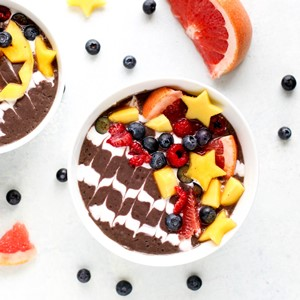

# Object Fit

Property ini digunakan untuk mengatur bagaimana ketika sebuah gambar dipaksa mengecil. Nilai yang bisa di isi adalah `fill`, `contain`, `cover`, `none`, dan `scale-down`.

berikut contoh penerapan-nya

```html



```

```css
img {
    margin-left: 10px;
    border: 2px solid;
    padding: 0.2rem;
    background-color: yellow;
}
.crop {
    width: 100px;
    height: 200px;
}
.fill {object-fit: fill;}
.contain {object-fit: contain;}
.cover {object-fit: cover;}
.none {object-fit: none;}
.scale-down {object-fit: scale-down;}
```